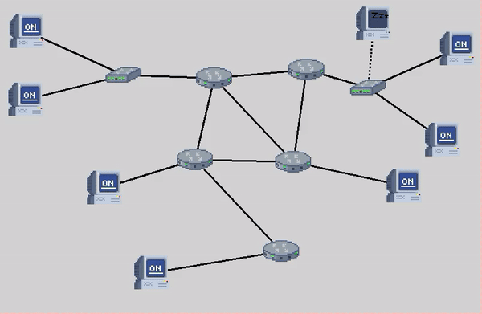

# NetVis
Computer Network Visualization

# Description
This project is designed to visualize network packets in real-time, allowing users to monitor, modify, and analyze network traffic visually. The tool captures network packets, processes the data, and presents it through a visualization that help in understanding network behavior.

# Demo

# Prerequisites
1. Python installation
2. Tkinter installation

# Steps to run the program
1. Open a terminal
2. Navigate to the directory
3. Run the script using `python 3 __main__.py`